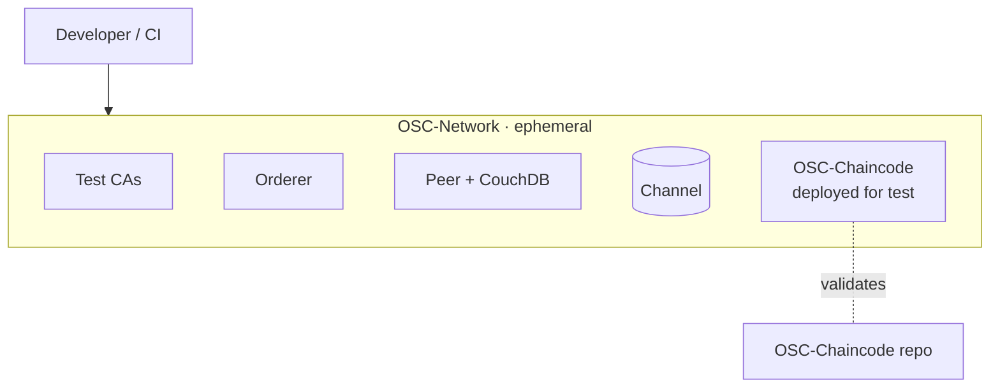
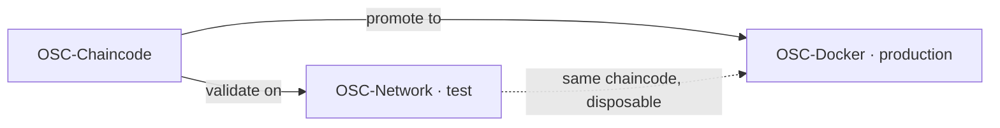

# OSC-Network — Architecture

> This document describes the role and structure of the OSC-IS **test/development Fabric network** and how it fits the platform's testing strategy. It is intentionally lighter than the production network's documentation in [OSC-Docker](../../OSC-Docker/docs/ARCHITECTURE.md).

- [1. Role in OSC-IS](#1-role-in-osc-is)
- [2. Prioritized quality attributes](#2-prioritized-quality-attributes)
- [3. Structure](#3-structure)
- [4. Relationship to production](#4-relationship-to-production)
- [5. Role in the test strategy](#5-role-in-the-test-strategy)
- [6. Trade-offs](#6-trade-offs)

---

## 1. Role in OSC-IS

OSC-Network provides a **disposable, real Fabric network** for developing and validating [OSC-Chaincode](../../OSC-Chaincode) changes and end-to-end flows before they reach the production ledger provisioned by [OSC-Docker](../../OSC-Docker). It exists to make blockchain changes *testable cheaply and safely*.

---

## 2. Prioritized quality attributes

| # | Quality attribute | Why prioritized | How it shows up |
|---|---|---|---|
| 1 | **Disposability / fast feedback** | Developers must spin up, test, and tear down quickly and often. | `network.sh up / deployCC / down` lifecycle; nothing is precious. |
| 2 | **Fidelity to production** | Tests are only meaningful if the network behaves like production. | Real orderer/peers/CAs/CouchDB and the same chaincode, not a mock. |
| 3 | **Low cost / risk** | Validation must not incur cloud cost or endanger the real ledger. | Runs locally (or on a simple test host); fully isolated from production. |
| 4 | **Portability** | Must run on developer machines and CI. | Docker-Compose and Kubernetes variants; runs under WSL on Windows. |

---

## 3. Structure

| Component | Notes |
|---|---|
| `test-network/` | Compose-based Fabric network derived from Hyperledger's reference test-network. |
| `test-network-k8s/` | Kubernetes deployment of the same, for cluster-based testing. |
| `OSC-IS-CC/` | Packaging to deploy OSC chaincode onto the test network. |
| `config/` | Fabric `core`/`orderer`/`configtx` configuration. |
| `wallets/` | **Development-only** identities — never production credentials. |

---

## 4. Relationship to production

The two networks run the **same chaincode** but serve opposite purposes: OSC-Network is ephemeral and risk-free; OSC-Docker is durable and authoritative. A chaincode change is expected to pass on OSC-Network before promotion to the OSC-Docker production deployment.

---

## 5. Role in the test strategy

OSC-Network is the **blockchain tier of the platform's end-to-end test strategy**. The intended local E2E stack is: API Gateway + PostgreSQL + RabbitMQ + workers (from [OSC-Artifact-Submission](../../OSC-Artifact-Submission)) pointed at either a mock OSC-API or — for full fidelity — a real OSC-API/adapter wired to an OSC-Network instance. This allows the complete submission → ledger → history flow to be exercised locally, without cloud spend and without polluting the production ledger.

---

## 6. Trade-offs

| Decision | Benefit | Cost / risk |
|---|---|---|
| Real Fabric network (vs a mock) | High-fidelity validation of chaincode and flows. | Heavier to run than a stub; requires Docker/WSL/k8s. |
| Ephemeral by design | Safe, repeatable, disposable. | No persistence — state is recreated each run. |
| Derived from Hyperledger test-network | Familiar, well-supported baseline. | Must be kept aligned with the production network's relevant config. |
| Separate repo from production (OSC-Docker) | Clear blast-radius separation. | Two network definitions to keep conceptually in sync. |

---

*See [OSC-Docker/docs/ARCHITECTURE.md](../../OSC-Docker/docs/ARCHITECTURE.md) for the production network and [OSC-Chaincode/docs/ARCHITECTURE.md](../../OSC-Chaincode/docs/ARCHITECTURE.md) for the contract under test.*
